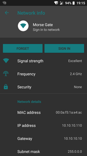
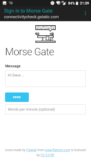
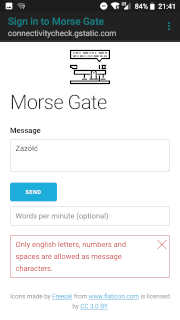
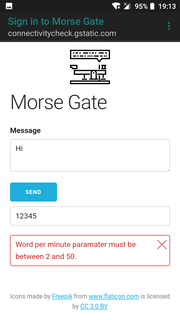
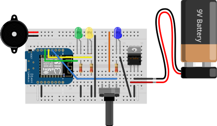

MorseGate
=========

[Wemos D1 mini] based [Morse code] message converter.

[](http://creativecommons.org/licenses/by-nc/4.0/)

Front-end part
--------------

[](./misc/Screenshot00.png) [](./misc/Screenshot01.png) [](./misc/Screenshot02.png) [](./misc/Screenshot03.png)


Hardware Schema
---------------



How to use
----------

On mobile devices connect to the **Morse Gate** WiFi network and choose *Sign In* option: the **Morse Gate** homepage will be opened.

### Troubleshooting

If *Sign in* prompt is not shown you might need to open http://192.168.168.1.

If the page is not loading try to disable all other network connections.

### curl

Sending message:

```
curl -i -v 'http://192.168.168.1/msg/send?msg=hello%20world'
```

Reading current status:

```
curl -i -v 'http://192.168.168.1/msg/status'
```


[Wemos D1 mini]: https://wiki.wemos.cc/products:d1:d1_mini
[Morse code]: https://en.wikipedia.org/wiki/Morse_code
