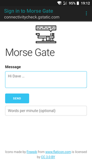
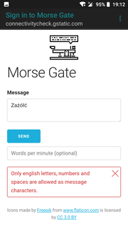
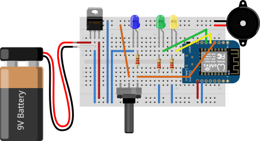

MorseGate
=========

[Wemos D1 mini] based [Morse code] message converter.

Just connect to the **Morse Gate** WiFi network and choose *Sign In* option: the **Morse Gate** homepage will be opened.

Front-end part
--------------

[](./misc/Screenshot00.png) [](./misc/Screenshot01.png) [](./misc/Screenshot02.png) [](./misc/Screenshot03.png)


Hardware Schema
---------------



How to use
----------

On mobile devices the *Sign In* option should allow you to see Morse Gate homepage.
Otherwise open the target page at: http://192.168.168.1.

### curl

Sending message:

```
curl -i -v 'http://192.168.168.1/msg/send?msg=hello%20world'
```

Reading current status:

```
curl -i -v 'http://192.168.168.1/msg/status'
```

Required Libraries
------------------

### `#include <Thread.h>`

* https://github.com/ivanseidel/ArduinoThread (MIT License)


### `#include <Morse.h>`

* https://github.com/etherkit/MorseArduino (no license specified)

Alernatives:

* https://github.com/willvincent/ArduinoMorse (MIT License)
* https://github.com/markfickett/arduinomorse (CC BY 3.0)

### `#include <Regexp.h>`

* https://github.com/nickgammon/Regexp (no license specified)

Alernatives:

* https://gitlab.com/rosie-pattern-language/rosie (MIT License)


[Wemos D1 mini]: https://wiki.wemos.cc/products:d1:d1_mini
[Morse code]: https://en.wikipedia.org/wiki/Morse_code
